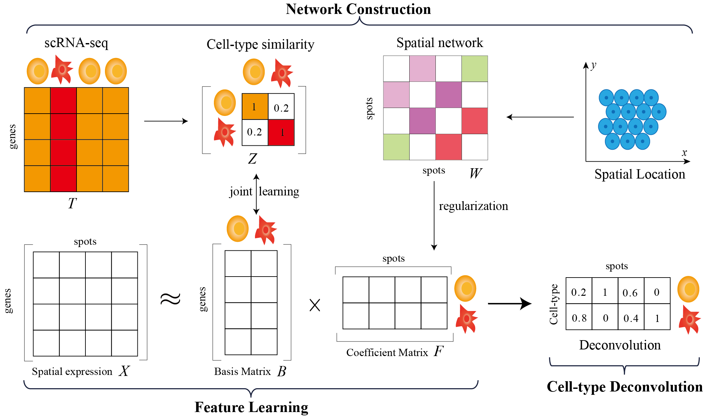

# jMF2D v1.1.0

## Enhancing and accelerating cell type deconvolution of spatial transcriptomics with dual network model

### Yuhong Zha, Quan Zou and Xiaoke Ma

Spatial transcriptomics technologies facilitate the understanding of structure and functions of complicated tissues by measuring spatial distribution of mRNA transcripts, yet it remains challenging to characterize expression of transcripts at the single cell level. Cell type deconvolution of spots addresses this issue by integrating the single-cell RNA sequencing (scRNA-seq) and spatial transcriptomics data to infer mixture of cell types for spots. Current algorithms first construct signatures of cell types from scRNA-seq data, and then perform deconvolution of spots in spatial transcritomics data, which are criticized for neglecting connection between scRNA-seq and spatial transcriptomics data, as well as time-consuming, hampering the down-stream analysis. To address these issues, a joint learning nonnegative matrix factorization algorithm for fast cell type deconvolution (aka jMF2D) is proposed, which integrates scRNA-seq and spatial transcriptomics data with a network-based model. Specifically, jMF2D decomposes spatial expression profiles of cells, where spatial coordinates of spots are incorporated with graph Laplacian regularization. To bridge connection of scRNA-seq and spatial transcriptomics data, jMF2D jointly learns cell type similarity network to enhance quality of signatures of cell types, thereby promoting accuracy and efficiency of deconvolution. Extensive experiments demonstrate that the proposed algorithms not only outperforms state-of-the-art baselines in terms of accuracy for cell type deconvolution, but also saves about 90% running time. The proposed model and algorithm provide an alternative for deconvolution of large-scale spatial transcriptomics data.



# Installation

#### 1. Start by using python virtual environment with [conda](https://anaconda.org/):

```
conda create -n jMF2D python=3.8
conda activate jMF2D
pip install -r <dir path>/requriments.txt
```

(Optional) To run the notebook files in tutorials, please ensure the Jupyter package is installed in your environment:

```
pip install ipykernel
python -m ipykernel install --name=jMF2D
```

### 2. To call MATLAB from Python

(Optional) If MATLAB is not installed on your system or if there is a version mismatch, we recommend downloading MATLAB R2021b from the following link: https://www.mathworks.com/products/new_products/release2021b.html.

```
cd <your dir path>/MATLAB/extern/engines/python
python setup.py install
```

Note: If you encounter issues while executing python setup.py install, you can try downgrading `setuptools` to version 58.0 using the following command:  pip install setuptools==58.0

### 3. Download the jMF2D code and related data

The data used in the tutorial can be obtained from the following links: [datasets](https://drive.google.com/drive/folders/1tZdHL0QrlbxBE9h9FHCC4qafn2NFJVUX)

Download the jMF2D code files and place the datasets folder into the directory. Then, follow the tutorials to complete the deconvolution and related visualizations.

# The fully implemented jMF2D in Python has been uploaded to PyPi

We have rewritten deconvolution.m in Python and uploaded the pure Python version of jMF2D to PyPi. You can now easily install and use jMF2D by following these steps.

```
conda create -n jMF2D python=3.8
conda activate jMF2D
pip install jMF2D
```

## System Requirements

#### Python support packages  (Python>=3.8): 

pandas, numpy, scanpy, scipy, scikit-learn, scikit-misc, matplotlib, seaborn, anndata, opencv-python, leidenalg, POT

For more details of the used packages, please refer to 'requirements.txt' file.

## File Descriptions:

Data/README.md: We provide download links for simulated data and breast cancer data for users.

Plot - The code for plotting heatmaps and spatial pies is provided.

jMF2D - The core code of jMF2D includes utils.py, deconvolution.m, and other essential files.

tutorials - Tutorials are provided for conducting experiments on the simulated dataset and the breast cancer dataset.

### Compared deconvolution algorithms

* [Cell2location](https://github.com/BayraktarLab/cell2location)
* [RCTD](https://github.com/vigneshshanmug/RCTD)
* [SPOTlight](https://rdrr.io/github/MarcElosua/SPOTlight)
* [Redeconve](https://github.com/ZxZhou4150/Redeconve)
* [CARD](https://yma-lab.github.io/CARD/documentation/04_CARD_Example.html)
* [DestVI](https://docs.scvi-tools.org/en/stable/tutorials/notebooks/spatial/DestVI_tutorial.html)
* [SpatialDWLS](https://github.com/QuKunLab/SpatialBenchmarking/blob/main/Codes/Deconvolution/SpatialDWLS_pipeline.r)
* [DSTG](https://github.com/Su-informatics-lab/DSTG/tree/main)

## Compared spatial domain identification algorithms

Algorithms that are compared include: 

* [SpaGCN](https://github.com/jianhuupenn/SpaGCN)
* [GraphST](https://deepst-tutorials.readthedocs.io/en/latest/)
* [stLearn](https://github.com/BiomedicalMachineLearning/stLearn)

### Contact:

We are continuing adding new features. Bug reports or feature requests are welcome.

Please send any questions or found bugs to Xiaoke Ma [xkma@xidian.edu.cn](mailto:xkma@xidian.edu.cn).

